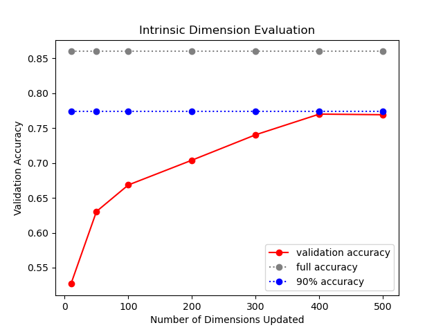
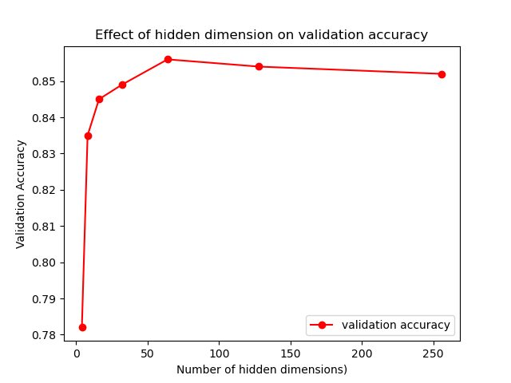

# Day 4: LSTM with IMDB - how why doesn't DNN overfit? (and how to choose hidden size...) 

## TO DO: intro 

Neural networks typically have XX number of parameters. And our dataset typically is much smaller. Did you ever wonder why doesn't 
In this tutorial we will  

### How many parameters does our current network have?   
   The general formula for calculating number of parameters in an LSTM network is given as follows:

   num_params = 4 * [(num_units + input_dim + 1) * num_units]
   
   Where 4 comes from the 4 neural network layers (W_forget, W_input, W_output, W_cell} and 1 comes from bias. 

   So the number of parameters in our LSTM model: 

   4 * (num_units^2 + (input_dim+1) * num_units) = 4 * (64 ^2 + 301 * 64) = 93,440 parameters 

   We are training the model on 50,000 * 0.9 * 0.9 = 40,500 samples 

### Why does it not terribly overfit? 

   So given that we are training on 93,440 parameters but only uses 40,500 samples for training purposes, why doesn't it terribly overfit? 

   For simpler models such as linear regression, the number of parameters is equal to the degrees of freedom. However, [the number 
is much lower than the number of parameters for deep neural networks](https://arxiv.org/abs/1603.09260). 
One way of getting a quantitative understanding of degrees of freedom for DNN is by calculating the intrinsic dimension. This [paper](https://arxiv.org/abs/1804.08838)
from the Uber AI lab comes with a [fun and educative video](https://www.youtube.com/watch?v=uSZWeRADTFI&feature=emb_logo).  
 
   Briefly, they proposed to train the neural network in a smaller, randomly oriented subspace rather than the large, native space. 

   This way, the gradient of loss in a space of D dimensions only moves in the d-dimensional subspace: 

   And finally, the intrinsic dimension is defined as dint90, or the d dimensions at which the model achieves 90% performance. 

#### How to calculate intrinsic dimension 
I figured it would be an interesting experiment to figure out the intrinsic dimension of our LSTM model. I used [an existing github 
implementation](https://github.com/jgamper/intrinsic-dimensionality) with some minor modifications (see code here). 

This requires a two-step modification from a regular NN module: 
First, in the initialization stage: Declare the random P matrix, extract all weights from pytorch, store them in a class param 
and delete the originals:  

           for name, param in module.named_parameters():
               ... 

                # Generates random projection matrices P, sets them to no grad
                self.random_matrix[name] = (
                    torch.randn(matrix_size, requires_grad=False).to(device)
                    / intrinsic_dimension ** 0.5
                )

                base, localname = module, name
                while "." in localname:
                    prefix, localname = localname.split(".", 1)
                    base = base.__getattr__(prefix)
                self.name_base_localname.append((name, base, localname))

           for name, base, localname in self.name_base_localname:
               delattr(base, localname)

Second, in the forward pass: Apply the project matrix, and then copy the parameters back to their original location:   
      
      def forward(self, x, x_lens):
        # Iterate over the layers
        for name, base, localname in self.name_base_localname:

            # Product between matrix P and \theta^{d}
            ray = torch.matmul(self.random_matrix[name], self.V)

            # Add the \theta_{0}^{D} to P \dot \theta^{d}
            param = self.initial_value[name] + torch.squeeze(ray, -1)

            setattr(base, localname, param)

            ...        
   
And now we can run a range of experiments by varying the dimensions of the subspace from 10 to 500: 
      
      for dim in [10, 50, 100, 200, 300, 400, 500]:
         run_experiment(dim)

Our experiment shows that the intrinsic dimension of our LSTM model is ~400, or **0.4%** of the parameter size. This matches 
with the estimate in the original paper. With 400 dimensions for 40,500 data points, we get roughly 100 data points/dimension. The risk of overfitting due to overparameterization is fairly low. 

## How do we choose number of hidden dimensions? 

The other topic I want to discuss is how to choose the number of hidden dimensions. You are likely to find a handful of [rules of thumbs](https://www.heatonresearch.com/) on the internet, none of which backed by theoretical proofs. 
In fact, it's hard to apply a generic rule of thumb because choosing the number of hidden dimension is essentially part of your effort to mitgiate the risk of underfitting or overfitting your data
on your model. 
Hence your choice of hidden dimension is dependent everything related to your model and the data, including 
the data size, the noise level in the data, the number of input and output units, the amount of regularization, the model architecture, etc. 

In [sample code](https://www.kaggle.com/lakshmi25npathi/imdb-dataset-of-50k-movie-reviews/notebooks) I came across training an LSTM model on the IMDB dataset, 
typically an LSTM unit between *64* and *256* are being used, but very little rationale was provided. The optimal hidden unit size for your model should only be chosen 
based on your validation results. Let's take a look at how the model performance vary based on the hidden size. 

Here we define "overfitting" as "validation/test accuracy is lower than training accuracy", and underfitting 
as "validation/test accuracy is lower than training accuracy". Note that signs of overfitting here is not necessarily a bad thing, 
as long as the validation/test performance continue to increase. We are only concerned when overfitting leads to deterioriating 
or stagnant validation/test performance. 

This plot of accuracy vs. hidden size shows three regimes:

   i. hidden size = 2: Model is slightly underfitting. 

   ii. hidden size = 4 - 16: Model starts to overfit, but all of training/test/validation accuracy continue to increase  

   iii) hidden size = 32 - 256: Model continues to overfit.  training accuracy continues to increase, while test/validation accuracy reachs a plateau. 
 
   iv) hidden size = 512 - 1024: Model is completely overfitting with training accuracy > 0.99. In the meantime, test/validation accuracy stagnates.

TO DO: rerun experiment, plot hidden dim vs train acc vs test acc vs val acc 

Other housekeeping stuff: 
1. Train-validation-test split  
   The data will be split into train, validation, and test moving forward. I've implemented a function called 
   train_val_test_split: 
   
2. It's time to switch over to GPU 
   https://medium.com/@exesse/cuda-10-1-installation-on-ubuntu-18-04-lts-d04f89287130
   Then install conda env 
   Packages installed: sklearn, bs4, matplotlib, pandas, lxml 
   a. Describe the difference between CPU and GPU code.  
   b. Benchmark performance on cpu against GPU - optimized for GPU performance. 

3. Various embeddings 
   For better understanding of differences and relations between difference embeddings, please check 
   Glove/wiki/word2vec papers. You should also be able to concatenate these various embeddings (although I did not find 
   signifcant gain via the concatenation in this case) 

## Further reading 
1. [Random projection using fastfood](http://proceedings.mlr.press/v28/le13.pdf) 
2. [Lilian Weng's blog](https://lilianweng.github.io/lil-log/2019/03/14/are-deep-neural-networks-dramatically-overfitted.html#intrinsic-dimension) (Note: this post is **a rare gem**. 
   Highly recommended for a thorough review and insightful discussions on model complexity.)
