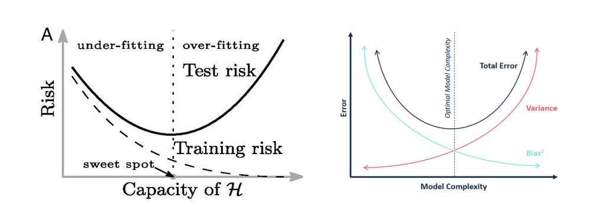

# Day 4: LSTM with IMDB - Does your neural network overfit and why?   

Even a shallow neural network (e.g. an LSTM with one hidden layer) may have tens of thousands of parameters, whereas a 
deep neural network (e.g. GPT3) could have billions of parameters. In the meantime, the size of training dataset size is 
typically much smaller than the number of parameters. How come neural networks don't overfit?  

### The concept of overfitting and underfitting in classical machine learning 
This is how the concept of overfitting/underfitting is often explained in classical machine learning theory: 

    

(left source: [Belkin et al, 2020.](https://www.pnas.org/content/116/32/15849.short) right source: [Cornell lecture on bias-variance tradeoff](https://www.cs.cornell.edu/courses/cs4780/2018fa/lectures/lecturenote12.html) 

In this context, "underfitting" happens when the model (or function class) H doesn't have enough parameters and is not complex enough to capture the pattern of the training data. 
Within the underfitting paradigm, both training and testing error rates are high (high bias). In contrast,"overfitting" happens when the model has too many parameters and is too complex. 
It captures too much noise of the training data and does not generalize well to the testing data. Within the overfitting paradigm, training error is relatively low but testing error is relatively high (high variance). 

This curve implies that: 

i) there is a sweet spot in the middle where both training error and testing error rates are low.  
ii) When we increase the model complexity (e.g. through increasing the number of model parameters), the testing error is doomed to increase. 

### How many parameters does our current network have?   
   The general formula for calculating number of parameters in an LSTM network is given as follows:

   num_params = 4 * [(num_units + input_dim + 1) * num_units]
   
   Where 4 comes from the four LSTM gates (W_forget, W_input, W_output, W_cell) and 1 comes from bias. 

   So the number of parameters in our LSTM model, given 64 hidden units is: 

      4 * (64 ^2 + (300+1) * 64) = 93,440 parameters

### Why doesn't our neural network overfit? 

   Given that we are training on 93,440 parameters but only use 50,000 * 0.81 = 40,500 samples for training purposes, why doesn't the model overfit? 
   Or, if it is terribly "overfitting" to the training data, why do we see reasonably good dev/test performance, contradicting to the classical ML risk curve? 

   This contradiction was explained by Belkin et al in their [PNAS paper](https://www.pnas.org/content/116/32/15849.short), which showed that the classical understanding is just 
   part of a bigger picture: 
   
    
   (source: [Belkin et al, 2020](https://www.pnas.org/content/116/32/15849.short))   
   
   The prior risk curve represents what's happening in the under-parameterized region. As the model capacity grows larger, 
   we move into the over-parameterized region, where training error is almost zero, and testing error stays low (Note that 
   the authors describe this as "double descent curve", but not a "double U" curve).  
   The authors reasoned that this is because model complexity may not tell you how well the underlying inductive bias matches the current problem. 
   Given that a reasonable inductive bias is "the regularity or smoothness of a function as measured by a certain function space norm", a larger model 
   such as a neural network makes it easier to find interpolating functions with smaller norm, thus matching the inductive bias.

#### Our own experiment in the over-parameterized region 
In this experiment, we'd like to understand how our LSTM model behaves under the over-parameterized condition. The training, validation and test datasets 
come from a 8.1:0.9:1 split. Each experiment was run for a specific hidden dimension size for 200 epochs. With a range of hidden dimensions between 
32 (42,624 parameters) and 2,048 (19,243,008 parameters) and a fairly small dataset (training sample size = 40,500), we are already under the over-parameterized condition. 

 

When the number of hidden dimensions varies from 32 to 2,048, our training accuracy ranges from 0.991 to 0.999, indicating a near-zero 
training error. Based on the classical machine learning terminology, we are certainly "overfitting" to the training data. At the same time, 
the testing and validation accuracy is nearing a plateau but shows no significant signs of deterioration. Our observation agrees with the 
description of the "modern, interpolation regime" from the double descent curve above.   

Our experiment suggests that we should not be concerned with "overfitting" caused by using a larger neural network. Instead, we should pay attention
to the trade-off between performance gain from increasing parameters and computational cost. 

### Neural network and its intrinsic dimensions  
   There's also a different angle to look at this: For simpler models such as linear regression, the number of parameters is equal to the degrees of freedom. 
   However, [the number is much lower than the number of parameters for deep neural networks](https://arxiv.org/abs/1603.09260). 
   One way of getting a quantitative understanding of degrees of freedom for neural networks is by calculating the intrinsic dimension. This [paper](https://arxiv.org/abs/1804.08838) 
   from the Uber AI lab comes with a [fun and educative video](https://www.youtube.com/watch?v=uSZWeRADTFI&feature=emb_logo).  
 
   Briefly, they proposed to train the neural network in a smaller, randomly oriented subspace rather than the large, native space, using a random 
   projection matrix *P*:  
        

   This way, the gradient of loss in a space of D dimensions moves into the d-dimensional subspace: 
   
    
   (image source: [Yosinski et al](https://arxiv.org/abs/1804.08838)) 

   And finally, the intrinsic dimension is defined as dint90, or the d dimensions at which the model achieves 90% performance. 

#### Our experiment with intrinsic dimensions 
To find out the intrinsic dimension of our LSTM model wrt IMDB dataset, I used [an existing github 
implementation](https://github.com/jgamper/intrinsic-dimensionality) with some minor modifications (see code [here](https://github.com/rantsandruse/pytorch_lstm_04imdb/tree/main/intrinsic_dim)). 

This requires a two-step modification from a regular NN module: 
First, in the initialization stage: Declare the random projection matrix P, extract all weights from pytorch, store them in class parameters and delete the originals:  

           for name, param in module.named_parameters():
               ... 

                # Generates random projection matrices P, sets them to no grad
                self.random_matrix[name] = (
                    torch.randn(matrix_size, requires_grad=False).to(device)
                    / intrinsic_dimension ** 0.5
                )

                base, localname = module, name
                while "." in localname:
                    prefix, localname = localname.split(".", 1)
                    base = base.__getattr__(prefix)
                self.name_base_localname.append((name, base, localname))

           for name, base, localname in self.name_base_localname:
               delattr(base, localname)

Second, in the forward pass: Apply the random projection matrix P, and then copy the parameters back to their original location:   
      
      def forward(self, x, x_lens):
        # Iterate over the layers
        for name, base, localname in self.name_base_localname:

            # Product between matrix P and \theta^{d}
            ray = torch.matmul(self.random_matrix[name], self.V)

            # Add the \theta_{0}^{D} to P \dot \theta^{d}
            param = self.initial_value[name] + torch.squeeze(ray, -1)

            setattr(base, localname, param)

            ...        
   
And now we can run a range of experiments by varying the dimensions of the subspace from 10 to 500: 
      
      for dim in [10, 50, 100, 200, 300, 400, 500]:
         run_experiment(dim)

Our experiment shows that the intrinsic dimension of our LSTM model is ~400, or **0.4%** of the parameter size.
 

We only ran it for hidden dimension=64, but you are likely to see similar answers with a different choice, as the magnitude of intrinsic dimensions 
is fairly robust to changes in layer width and depth. 

## Main takeaways 
1. The classical concept of "overfitting" and "underfitting" and its implications do not work well with neural networks in
   the overparameterized region. Overparameterized neural networks are likely to achieve zero training error without compromising 
   testing performance. In other words, "overfitting" on training data is not the enemy of neural networks (and other ML models with high complexity).  
2. The intrinsic dimension idea can further help us understand why "overfitting" does not happen with neural networks: 
   - The intrinsic dimension of a neural network is orders of magnitude smaller than the number of parameters. 
   - The size of intrinsic dimension (as a measure of model complexity) is quite robust against changes in the number of parameters (layer width and depth).  
3. Given 1 and 2, when choosing the number of hidden dimensions of our LSTM model, we are less concerned with the notion that having too many parameters 
   would "overfit" and lead to  higher testing error rate. Instead, we are more concerned with the trade-off between computational cost 
   and performance. In other words, you are likely to choose a middle ground where your computation is not yet too expensive 
   and your model performance is quite good.
   
## Further reading
1. [Lilian Weng's blog](https://lilianweng.github.io/lil-log/2019/03/14/are-deep-neural-networks-dramatically-overfitted.html#intrinsic-dimension) (this post is **a rare gem**. 
   Highly recommended for a thorough review and insightful discussions on model complexity and beyond)
2. [The need for biases in learning generalization](http://www-cgi.cs.cmu.edu/~tom/pubs/NeedForBias_1980.pdf)
3. [Random projection using fastfood](http://proceedings.mlr.press/v28/le13.pdf) 

